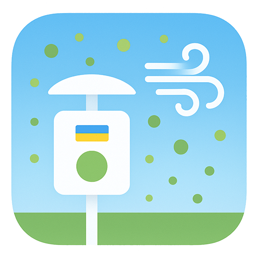

[](https://stand-with-ukraine.pp.ua/)

<p align="center">
  
</p>

# 💨 Poltava Air Monitor

[](https://github.com/custom-components/hacs)
[](https://github.com/inceon/ha_poltava_air_monitor/releases)

> A Home Assistant integration for air quality monitoring in Poltava, Ukraine.

This integration provides real-time air quality information from the official Poltava city monitoring stations, including:
- **Air Quality Index (AQI)** with quality descriptions and recommendations
- **Particulate Matter**: PM2.5, PM10, PM1
- **Gases**: Ozone (O₃), Nitrogen Dioxide (NO₂), Sulfur Dioxide (SO₂), Carbon Monoxide (CO)
- **Weather**: Temperature, Humidity, Atmospheric Pressure
- **Wind**: Speed and Direction

## Features

✅ **Multiple Stations**: Choose from all monitoring stations in Poltava  
✅ **Auto-Discovery**: Find the nearest station by coordinates  
✅ **Real-time Data**: Updates every 5 minutes  
✅ **Rich Information**: Quality indices, daily averages, and recommendations  
✅ **Bilingual**: Full support for English and Ukrainian  
✅ **Standard Integration**: Uses Home Assistant's native sensor types and device classes

## Installation

### HACS (Recommended)

1. Open HACS in your Home Assistant instance
2. Click on **Integrations**
3. Click the **...** menu in the top right
4. Select **Custom repositories**
5. Add this repository URL: `https://github.com/inceon/ha-poltava-air-monitor`
6. Select **Integration** as the category
7. Click **Add**
8. Find **Poltava Air Monitor** in the list and click **Download**
9. Restart Home Assistant

### Manual Installation

1. Copy the `custom_components/poltava_air_monitor` directory to your Home Assistant's `custom_components` directory
2. Restart Home Assistant

## Configuration

### Adding the Integration

1. Go to **Settings** → **Devices & Services**
2. Click **Add Integration**
3. Search for **Poltava Air Monitor**
4. Follow the configuration steps:
   - Enter a name for your integration (default: "Poltava Air Monitor")
   - Choose how to select a station:
     - **Select from list**: Browse all available monitoring stations
     - **Find nearest by coordinates**: Enter latitude/longitude to auto-select

### Available Monitoring Stations

The integration supports all official monitoring stations in Poltava:

- **Пост №13** - Район вулиць Симона Петлюри та Олеся Гончара
- **Пост №1** - Район вулиць Верхолянської, Гетьманської (Міське сміттєзвалище)
- **Пост №5** - Район вулиць Європейської, Раїси Кириченко
- **Пост №10** - Район вулиць Чумацький шлях, Кузьми Скрябіна

## Sensors

The integration creates the following sensors for each monitoring station:

### Air Quality
- **Air Quality Index** - Overall AQI value with quality description and recommendations
- **PM2.5** - Fine particulate matter (µg/m³)
- **PM10** - Coarse particulate matter (µg/m³)
- **PM1** - Ultra-fine particulate matter (µg/m³)

### Gases
- **Ozone** - O₃ concentration (µg/m³)
- **Nitrogen Dioxide** - NO₂ concentration (µg/m³)
- **Sulfur Dioxide** - SO₂ concentration (µg/m³)
- **Carbon Monoxide** - CO concentration (µg/m³)

### Weather
- **Temperature** - Air temperature (°C)
- **Humidity** - Relative humidity (%)
- **Pressure** - Atmospheric pressure (hPa)
- **Wind Speed** - Wind speed (m/s)
- **Wind Direction** - Wind direction (degrees)

### Sensor Attributes

Each pollutant sensor includes additional attributes:
- `daily_average` - Rolling daily average value
- `quality_index` - Individual quality index for the parameter (when applicable)

The AQI sensor includes:
- `index` - Quality level name (e.g., "Допустимий")
- `description` - Quality description
- `recommendation` - Health recommendations
- `updated` - Last update time
- `station_name` - Monitoring station name
- `station_address` - Station address
- `station_type` - Station type (e.g., "транспортний")

## Usage Example

### Dashboard Card

```yaml
type: entities
title: Poltava Air Quality
entities:
  - entity: sensor.poltava_air_monitor_air_quality_index
    secondary_info: attribute
    attribute: description
  - entity: sensor.poltava_air_monitor_pm2_5
  - entity: sensor.poltava_air_monitor_pm10
  - entity: sensor.poltava_air_monitor_temperature
  - entity: sensor.poltava_air_monitor_humidity
```

### Automation Example

```yaml
automation:
  - alias: "Air Quality Alert"
    trigger:
      - platform: numeric_state
        entity_id: sensor.poltava_air_monitor_air_quality_index
        above: 100
    action:
      - service: notify.mobile_app
        data:
          title: "Poor Air Quality"
          message: >
            Air quality in Poltava is poor ({{ states('sensor.poltava_air_monitor_air_quality_index') }}). 
            {{ state_attr('sensor.poltava_air_monitor_air_quality_index', 'recommendation') }}
```

## Data Source

This integration uses data from the official Poltava city air quality monitoring system:
- API: `https://improvement-pl.gov.ua`
- Update Interval: 5 minutes
- Data provided by: Poltava City Council

> **Note**: This integration is not affiliated with the Poltava City Council. It is developed independently by the community.

## Troubleshooting

### Integration doesn't appear in the list
- Make sure you've restarted Home Assistant after installation
- Check the logs for any error messages

### No data or sensors showing "Unavailable"
- Verify your internet connection
- Check if the API endpoint is accessible: `https://improvement-pl.gov.ua/posts/posts.json`
- Look for errors in Home Assistant logs under **Settings** → **System** → **Logs**

### Incorrect or missing sensors
- Some parameters might be unavailable for certain monitoring stations
- The integration automatically filters out sensors with no data

## Contributing

Contributions are welcome! Please feel free to submit a Pull Request.

### Development Setup

1. Clone this repository
2. Install Home Assistant development environment
3. Link this integration to your development instance
4. Make changes and test

## License

MIT © Serhii Okhrimenko ([@inceon](https://github.com/inceon))

## Credits

- Inspired by the [LUN Misto Air](https://github.com/denysdovhan/ha-lun-misto-air) integration
- Data provided by Poltava City Council air monitoring system

## Support

If you find this integration useful, please give it a ⭐ on GitHub!

For issues and feature requests, please use the [GitHub Issues](https://github.com/inceon/ha-poltava-air-monitor/issues) page.
